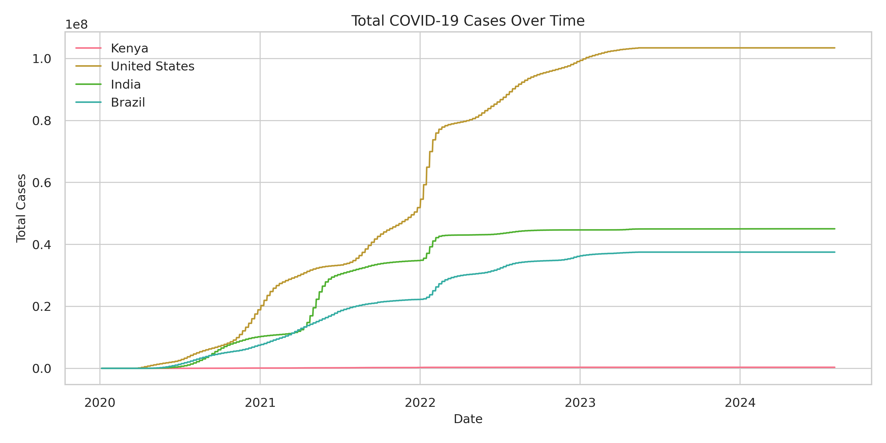
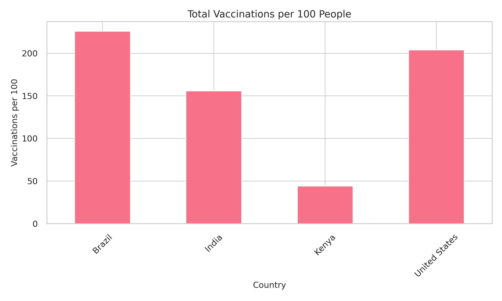

# COVID-19 Global Data Tracker


A data analysis project tracking global COVID-19 trends, including cases, deaths, and vaccination progress across countries.

## 📌 Features

- **Data Analysis**:
  - Time-series trends of cases/deaths
  - Vaccination progress comparison
  - Country-wise metrics
- **Visualizations**:
  - Interactive choropleth world maps
  - Time-series line charts
  - Comparative bar charts
- **Reporting**:
  - Jupyter Notebook with narrative insights
  - Exportable PDF/HTML reports

## 📂 Project Structure

```
covid19-tracker/
├── data/
│   └── owid-covid-data.csv       # Raw dataset
├── notebooks/
│   └── COVID-19_Analysis.ipynb   # Main analysis notebook
├── visuals/                      # Generated plots
│   ├── cases_over_time.png
│   ├── vaccination_rates.png
│   └── global_cases_map.html
└── README.md
```

## 🛠️ Installation

1. Clone the repository:
   ```bash
   git clone https://github.com/Jepkosgei3/Covid-19-Data-Analytics-.git
   cd Covid-19-Data-Analytics
   ```

2. Install dependencies:
   ```bash
   pip install -r requirements.txt
   ```
   Or manually:
   ```bash
   pip install pandas matplotlib seaborn plotly jupyter
   ```

## ▶️ Usage

1. Download the dataset:
   ```bash
   wget https://covid.ourworldindata.org/data/owid-covid-data.csv -O data/owid-covid-data.csv
   ```

2. Run the Jupyter Notebook:
   ```bash
   jupyter notebook notebooks/COVID-19_Analysis.ipynb
   ```

3. Key Sections:
   - Data cleaning and preprocessing
   - Time-series analysis
   - Vaccination progress
   - Interactive world map

## 📊 Sample Visualizations

| Cases Over Time | Vaccination Rates | World Map |
|-----------------|-------------------|-----------|
|  |  |  |

## 📝 Key Insights

1. **Vaccination Impact**: Countries with early vaccination programs showed faster decline in death rates
2. **Regional Variations**: Case fatality rates varied significantly by continent
3. **Infection Waves**: Distinct peaks correlated with variant emergence timelines
   
## 🙏 Acknowledgments

- Data source: [Our World in Data](https://ourworldindata.org/covid-vaccinations)
- Visualization tools: Plotly, Matplotlib
